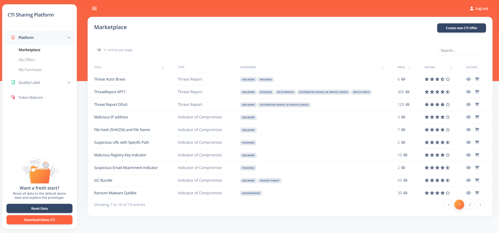
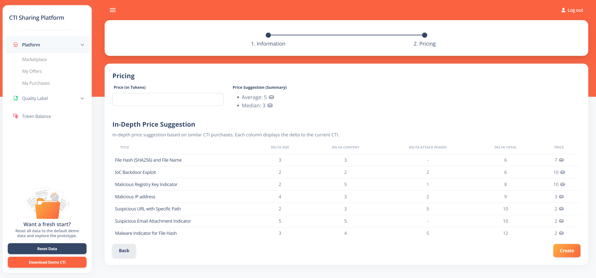
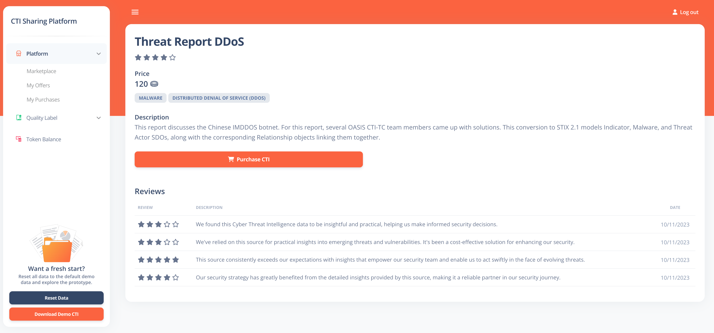
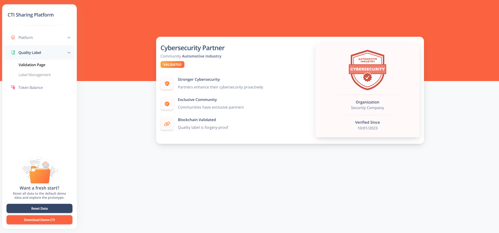
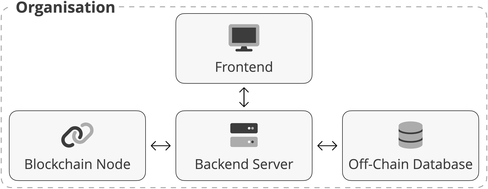

# Incentivized Cyber Threat Intelligence Sharing Platform

Cyber Threat Intelligence (CTI) presents information about cyber security threats and enables organizations to deal with them and proactively defend themselves against them. However, few organizations share their knowledge in a structured way via a sharing platform. Thus, we integrated incentives to motivate organizational CTI sharing.

We first introduce our [Live Prototype](https://platform.uversy.com/) and explain the [Architecture](#architecture). Subsequently, we present the implementation of the [Blockchain](#blockchain) and the [Off-Chain Database](#offchain). Finally, we outline the [Backend Server and Frontend](#backend).

## Table of Contents
[1. Live Prototype](#live)  
[2. Architecture](#architecture)  
[3. Blockchain](#blockchain)  
[4. Off-Chain Database](#offchain)   
[5. Backend Server and Frontend](#backend)

<a name="live"/>

## 1. Live Prototype

We deployed a live prototype to demonstrate the incentivized CTI sharing platform.
**Live Prototype:** [https://platform.uversy.com/](https://platform.uversy.com/)

**Note, in the bottom left corner of the prototype, you can:**
1. Manually reset all data on the platform to the default demo data
2. Download a demo CTI record to offer on the platform

**The prototype offers the following features, among others:**
- Purchase and download CTI records **(<ins>Financial Payments</ins>)**
- Offer new CTI records **(<ins>with Price Suggestions</ins>)**
- View the ratings of all CTI records and submit a rating **(<ins>Reputation System</ins>)**
- Validate the **<ins>Marketing Label</ins>** and see the requirements
- View the current token balance and transaction history
- **<ins>Community Sharing</ins>** is enabled through the demo account

**Screenshots of the Live Prototype:**
              
  

Figure 1: *Financial payments in the marketplace for CTI records*

<br/>

  

Figure 2: *Price suggestion to set the price of a CTI record*

<br/>

  

Figure 3: *Reputation system displaying ratings for the CTI record*

<br/>

  

Figure 4: *Marketing label highlighting the participation in proactive cybersecurity*

<a name="architecture"/>

## 2. Architecture

The platform architecture consists of four components: [Blockchain](#blockchain), [Off-Chain Database](#offchain), [Backend Server and Frontend](#backend). The following figure shows the relationships between the components. Every participating organization deploys every component.

  

Figure 5: *Architecture of the CTI sharing platform*

We integrated 35 demo CTI records into our prototype to demonstrate the platform's functionalities. We collected the CTI records from [Alienvault](https://otx.alienvault.com/), [CISA](https://www.cisa.gov/news-events/cybersecurity-advisories), and [OASIS](https://oasis-open.github.io/cti-documentation/stix/intro). All 35 CTI records are in the folder [Demo CTI](Demo%20CTI/).

<a name="blockchain"/>

## 3. Blockchain

We chose [Hyperledger Besu](https://github.com/hyperledger/besu) as the blockchain to enable integrity and offer custom tokens as a financial incentive to share CTI. We store metadata of the CTI records and transactions on the blockchain. The smart contracts are in the folder [Smart Contracts](Smart%20Contracts/).

#### Hardware requirements  
2 GPU cores, 4 GB memory, 64 GB storage

#### Deploy the Blockchain

1. Install Java JDK  
```sudo apt-get update```  
```sudo apt install openjdk-21```  
```java -version```  

3. Download & unzip Besu package  
   ```curl -O https://hyperledger.jfrog.io/artifactory/besu-binaries/besu/23.10.2/besu-23.10.2.zip```  
   ```unzip  besu-23.10.2.zip```

5. Configuration  
   ```cd ~/besu-23.10.2/bin/```  
   ```mkdir IBFT-Network```  
   ```cd IBFT-Network```  
   ```vim genesis.json```  paste the genesis.json:  
   ```json
   {"config" : {
       "chainId" : 1337,
       "muirglacierblock" : 0,
       "ibft2" : {
         "blockperiodseconds" : 1,
         "epochlength" : 30000,
         "requesttimeoutseconds" : 2
       }
   },
   "nonce" : "0x0",
   "timestamp" : "0x58ee40ba",
   "gasLimit" : "0x1fffffffffffff",
   "contractSizeLimit" : 2147483647,
   "difficulty" : "0x1",
   "mixHash" : "0x63746963616c2062797a616e74696e65206661756c7420746f6c6572616e6365",
   "coinbase" : "0x0000000000000000000000000000000000000000",
   "alloc" : {
      "fe3b557e8fb62b89f4916b721be55ceb828dbd73" : {
         "privateKey" : "8f2a55949038a9610f50fb23b5883af3b4ecb3c3bb792cbcefbd1542c692be63",
         "comment" : "private key and this comment are ignored. In a real chain, the private key should NOT be stored",
         "balance" : "0xad78ebc5ac6200000"
       },
    "627306090abaB3A6e1400e9345bC60c78a8BEf57" : {
         "privateKey" : "c87509a1c067bbde78beb793e6fa76530b6382a4c0241e5e4a9ec0a0f44dc0d3",
         "comment" : "private key and this comment are ignored. In a real chain, the private key should NOT be stored",
         "balance" : "90000000000000000000000"
      },
    "f17f52151EbEF6C7334FAD080c5704D77216b732" : {
         "privateKey" : "ae6ae8e5ccbfb04590405997ee2d52d2b330726137b875053c36d94e974d162f",
         "comment" : "private key and this comment are ignored. In a real chain, the private key should NOT be stored",
         "balance" : "90000000000000000000000"
       }
   },
   "extraData" : "0xf87ea00000000000000000000000000000000000000000000000000000000000000000f85494377d0a9b2c989830aab9f5a6cc709f954a03149994cb2a31fbc030774b7781d41183e8993627c4eae69413140116396fddf7c5d81f908155cba602512c5a949b149085706cf7ae775632f290c5b644ed616c04808400000000c0"
   }
   ```

7. Create new node data directory   
   ```mkdir node/data```  
   ```cd node```
   
9. Boot up node    
   ```~/besu-23.10.2/bin/besu --data-path=data --genesis-file=../genesis.json --bootnodes=enode://d43f81e5a68d22038d3e6aab863f8f55805ec60aeca830504f9a9daeeca952499fb9dd480cac1a0494997c9d15a3aa69e01874529d44433d81df7d4465cfa46b@127.0.0.1:30303 --p2p-port=30308 --rpc-http-enabled --rpc-http-api=ADMIN,ETH,NET,IBFT,WEB3,TXPOOL --host-allowlist="*" --rpc-http-cors-origins="all" --rpc-http-host=0.0.0.0 --rpc-http-port=8550 --min-gas-price=0```

<a name="offchain"/>

## 4. Off-Chain Database

We store the CTI records in [Couchbase](https://github.com/couchbase) as the off-chain database. Thereby, the STIX format offers a structured exchange of CTI records.  

#### Hardware requirements  
2 CPU cores, 4 GB memory, 8 GB storage

#### Deploy the Off-Chain Database

1. Download couchbase package  
```curl -O https://packages.couchbase.com/releases/couchbase-release/couchbase-release-1.0-noarch.deb```

3. Install the package  
```sudo dpkg -i ./couchbase-release-1.0-noarch.deb```

4. Reload the database  
```sudo apt-get update```

5. Install the latest release  
```sudo apt-get install couchbase-server-community```

<a name="backend"/>

## 5. Backend Server and Frontend

The backend server is the centerpiece and communicates with the blockchain node and the off-chain database. This communication is built on [Node.js](https://github.com/nodejs). Furthermore, the backend server hosts the frontend. This is accomplished using the PHP framework [Laravel](https://github.com/laravel).  

#### Hardware requirements  
2 GPU cores, 8 GB memory, 32 GB storage

#### Deploy the Backend Server and Frontend

1. Install all composer dependencies  
```composer install```

2. Modify the configuration  
Copy `.env.example` to `.env` and update the configuration

3. Generate the keys  
```php artisan key:generate```

4. Start the application  
```php artisan serve```
